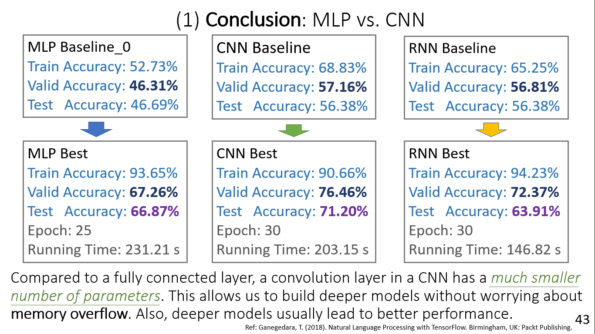
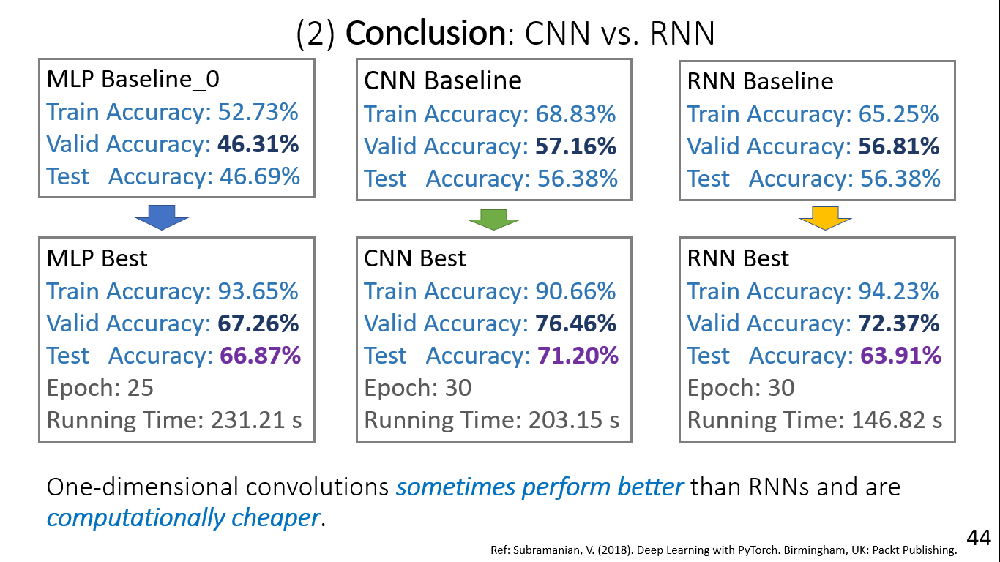
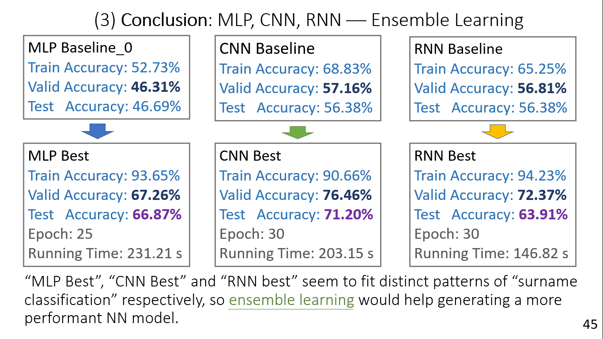

# NLP-Surname-Classification

**Keywords**: Natural Language Processing(NLP), text mining, classification, Multilayer Perceptron(MLP), Convolutional Neural Network(CNN), Recurrent Neural Network(RNN)

- The code mainly comes from the book **Rao, D. & McMahan, B. (2019). Natural Language Processing with PyTroch. California, CA: O'Reilly Media**. Based on that, I ***tuned the model and visualize the outcomes***. 
- This was actually my final project of the *graduate level* course ***"PyTorch and Machine Learning"*** of *MIS department* in NCCU. In addition, I got ***89 (A)*** in this course.

- The reader may ***refer to PPT & PDF for complete content***, and refer to the ***same code with results shown on Colab*** in the following links:
1. Preprocessing: https://bit.ly/3hGWYhs
2. MLP: https://bit.ly/3nTLxpf
3. CNN: https://bit.ly/3rwRCKr
4. RNN: https://bit.ly/3ptfcG8

## Outline
(1) Dataset \
(2) Data Preprocessing \
(3) Neural Networks Tuning Tips \
(4) Model Introduction & Baseline Model \
(5) MLP \
(6) CNN \
(7) RNN \
(8) Conclusion \
(9) Reference 

## (1) Dataset

>  The surname dataset, a collection of 10,000 surnames from 18 different nationalities collected by the authors from different name sources on the Internet. We split the data into 70% training data, 15% validation data, and 15% test data.

## (2) Data Preprocessing

- First, we split the surname dataset into 70% training data, 15% validation data and 15% test data. \
- Next, we vectorize the surnames using one-hot encoding. We utilize two variants — “collapsed one-hot vector” and “one-hot matrix.” We use “collapsed one-hot vector” in MLP to save running time, and use “one-hot matrix” in CNN & RNN. \
- In short, “collapsed one-hot vector” doesn’t retain the sequential information and only gives the Boolean values of a character appears or not , whereas “one-hot matrix” records the sequential information.

## (3) Neural Networks Tuning Tips
Inspect ML17 for the NN tuning tips. \
[ML17: Tuning Deep Networks |  Activators, optimizers, epochs, mini-batch size, BN, dropout and weight decay](https://medium.com/analytics-vidhya/ml17-a2f9315e5f1a)

## (4) Model Introduction & Baseline Model

### 4-1 Model Introduction
• Neuron: Minimum unit of neural network. \
• Perceptron: A single-layer neural network. \
• FNN(feedforward neural network): MLP(multilayer perceptron, also called “fully-connected” network), CNN(convolutional neural network). \
• RNN(recurrent neural network): RNN, LSTM(long short-term memory), GRU(gated recurrent unit). 

### 4-2 Baseline Model
We utilize the exactly the same models of MLP & CNN retrieved from the book as the baseline models of MLP & CNN respectively. As for RNN, we do the same thing but slight adjust the drop probability from 50% to 0% since 0% yield better performance.

## (5) MLP
### 5-1 Baseline MLP Model
### 5-2 Best MLP Model
### 5-3 MLP Summary

## (6) CNN
### 6-1 Baseline CNN Model
### 6-2 Best CNN Model
### 6-3 CNN Summary

## (7) RNN
### 6-1 Baseline RNN Model
### 6-2 Best RNN Model
### 6-3 RNN Summary

## (8) Conclusion
 \
 \
 

## (9) Reference
1. Géron, A. (2019). Hands-on Machine Learning with Scikit-Learn, Keras, and TensorFlow (2nd ed.). California, CA: O’Reilly Media.
2. Rao, D. & McMahan, B. (2019). Natural Language Processing with PyTroch. California, CA: O’Reilly Media.
3. Sarkar, D. (2019). Text Analytics with Python (2nd ed.). Karnataka, India: Apress.
4. Ganegedara, T. (2018). Natural Language Processing with TensorFlow. Birmingham, UK: Packt Publishing.
5. Subramanian, V. (2018). Deep Learning with PyTorch. Birmingham, UK: Packt Publishing.
6. Patterson, J. & Gibson, A. (2017). Deep Learning: A Practitioner’s Approach. California, CA: O’Reilly Media.
7. 斎藤康毅 (2016). ゼロから作るDeep Learning ―Pythonで学ぶディープラーニングの理論と実. Japan, JP: O’Reilly Japan.
8. Kuo, M. (2021). ML16: Hands-on Text Preprocessing. Retrieved from https://bit.ly/3tsS6Bz

